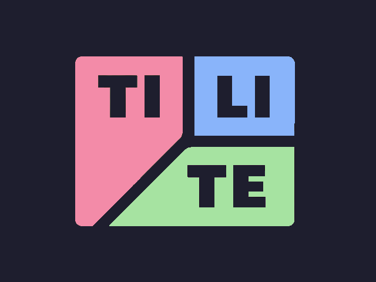

<p align="center">
  
  <br/>
  
  
  
</p>

---

# Tilite

Tilite is a ultra-light minimal dynamic window manager with just over 2k SLOC. This project seeks to cover the exact minimum number of features I need to have the desktop experience I want. This window manager is not designed to be general purpose but if it fits your use case I hope you find it as useful as I do.

The main thing that may prevent you from using this wm is that I don't have multiple monitor support because I don't need it. If you'd like to add it as a patch submit a PR with a patch file and I could add it as a build option.

---

## Dependencies

- `libX11`
- `Xinerama`
- `XCursor`
- `CC`
- `Make`

## Compiling/Installation

```
make
sudo make install
```

Then just add tilite to your `.xinitrc` and you're good to go. You could also make a desktop entry for it if you want to use a display manager but this repo doesn't provide one.

## Configuration

All configuration of tilite is done at compile time in the config.h header. A sample one is provided in this repo.

## Thanks & Inspiration

- dwm - the og minimal tiler
- sxwm - lots of source code basis
